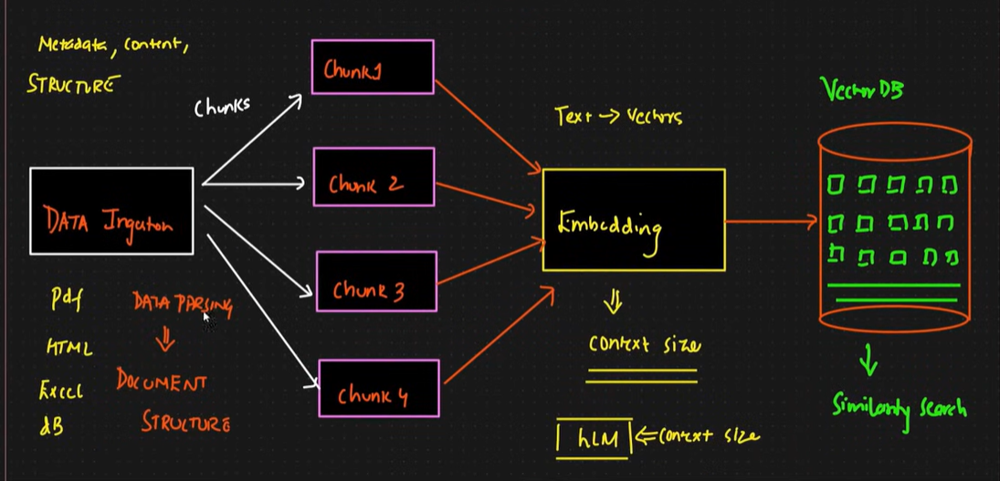

# RAG

RAG is the process of optimizing the output of a LLM, So it references an authoritative knowledge base outside of its training data sources before generating a response. 

LLM are trained on vast volumes of data & use billions of parameters to generate origninal output for tasks like answering questions, translating languages, completing sentences.

RAG extends the already powerful capabilities of LLMs to specific domains or an organizations internal knowledge base, all without the need to retrain the model. It is a cost effective approach to improving LLM output so it remains relevant, accurate, & usefull in various contexts.

## What RAG Solves

1. Hallucination
2. Fine Tuning - Take lots of efforts, computaion & time

## RAG Pipeline

1. Data Ingestion pipeline: 
   Ingestion -> Parsing -> Chunking -> Indexing -> Embedding -> Storing into DB
   

2. Retreival Pipeline:
   user query -> Embedding -> Search the DB -> Rerank -> Query + Chunks to LLM

Data parsing
Chunking Strategies
Optimization
Context Engineering

